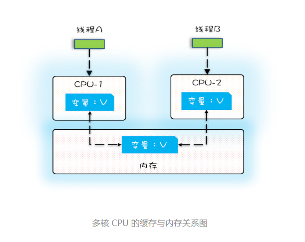

# 一 跳出来看全景

-   分工：拆分任务，Java SDK 并发包里的 Executor、Fork/Join、Future 本质上都是一种分工方法。除此之外，并发编程领域还总结了一些设计模式，基本上都是和分工方法相关的，例如生产者 - 消费者、Thread-Per-Message、Worker Thread 模式等都是用来指导你如何分工的。
    
-   同步：在并发编程领域里的同步，主要指的就是线程间的协作，本质上和现实生活中的协作没区别，不过是**一个线程执行完了一个任务，如何通知执行后续任务的线程开工**而已。
    
    解决协作问题的核心技术是**管程**，管程是一种解决并发问题的通用模型，**管程是解决并发问题的万能钥匙**。
    
-   互斥：并发程序里，当多个线程同时访问同一个共享变量的时候，结果是不确定的。不确定，则意味着可能正确，也可能错误，事先是不知道的。而导致不确定的主要源头是可见性问题、有序性问题和原子性问题，为了解决这三个问题，Java 语言引入了内存模型，内存模型提供了一系列的规则，利用这些规则，我们可以避免可见性问题、有序性问题，但是还不足以完全解决线程安全问题。解决线程安全问题的核心方案还是互斥。
    
    实现互斥的核心技术就是锁，Java 语言里 synchronized、SDK 里的各种 Lock 都能解决互斥问题。虽说锁解决了安全性问题，但同时也带来了性能问题，那如何保证安全性的同时又尽量提高性能呢？可以分场景优化，Java SDK 里提供的 ReadWriteLock、StampedLock 就可以优化读多写少场景下锁的性能。还可以使用无锁的数据结构，例如 Java SDK 里提供的原子类都是基于无锁技术实现的。
    
    除此之外，还有一些其他的方案，原理是不共享变量或者变量只允许读。这方面，Java 提供了 Thread Local 和 final 关键字，还有一种 Copy-on-write 的模式。
    
    使用锁除了要注意性能问题外，还需要注意死锁问题。
    
    这部分内容比较复杂，往往还是跨领域的，例如要理解可见性，就需要了解一些 CPU 和缓存的知识；要理解原子性，就需要理解一些操作系统的知识；很多无锁算法的实现往往也需要理解 CPU 缓存。这部分内容的学习，需要博览群书，在大脑里建立起 CPU、内存、I/O 执行的模拟器。这样遇到问题就能得心应手了。
    


# 二 钻进去，看本质

## 01 | 可见性、原子性和有序性问题：并发编程Bug的源头
**源头之一：缓存导致的可见性问题**

-   单核时代，所有的线程都是在一颗 CPU 上执行，CPU 缓存与内存的数据一致性容易解决。
    
    一个线程对共享变量的修改，另外一个线程能够立刻看到，我们称为**可见性**。
    
-   多核时代，每颗 CPU 都有自己的缓存，这时 CPU 缓存与内存的数据一致性就没那么容易解决了，当多个线程在不同的 CPU 上执行时，这些线程操作的是不同的 CPU 缓存。比如下图中，线程 A 操作的是 CPU-1 上的缓存，而线程 B 操作的是 CPU-2 上的缓存，很明显，这个时候线程 A 对变量 V 的操作对于线程 B 而言就不具备可见性了。这个就属于硬件程序员给软件程序员挖的“坑”。


**源头之二：线程切换带来的原子性问题**


```java	
public 
	
{
}
```

| d   | kj    |
| --- | ----- |
| ksk | kdmsk | 
